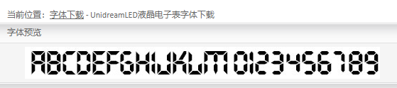
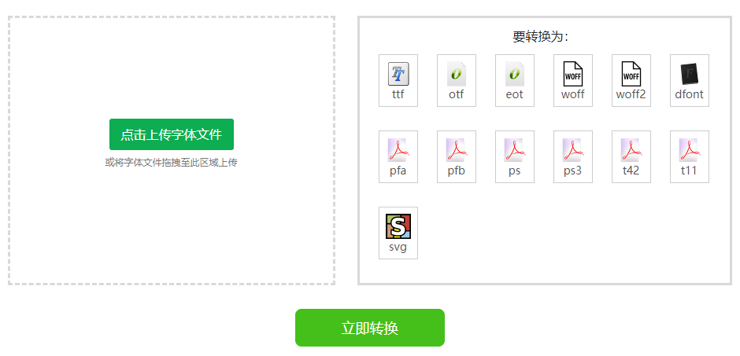

# 教你设置自定义字体适应CSS3 @font-face 规则
最近由于工作需要将网站上的数字的字像LED字体那样显示，所以在网上找到了一种比较接近的字体




然后下载下来字体的格式是.ttf，且只有一种，而且我们想用CSS3 @font-face 规则 来使用自定义字体则需要用到.eot、.otf、.svg、.ttf、.woff这五种后缀的字体一起进行设置，才能兼容绝大部的浏览器

#### CSS3 @font-face 规则

实例
指定名为"FontTest"的字体，并指定在哪里可以找到它的URL：

```
@font-face
{
  font-family: 'FontTest';
  src: url('fonts/UnidreamLED.ttf');
  src: url('fonts/UnidreamLED.eot'); /* IE9 */
}
```

然而要兼容以下浏览器


则要进行如下设置

```
@font-face {
  font-family: 'FontTest';
  src: url('fonts/UnidreamLED.ttf');
  src: url('fonts/UnidreamLED.eot');
  src: url('fonts/UnidreamLED.eot') format('embedded-opentype'), url('fonts/UnidreamLED.woff') format('woff'), url('fonts/UnidreamLED.ttf') format('truetype'), url('fonts/UnidreamLED.svg#fontawesomeregular') format('svg');
}
```

也就像前面所说需要使用到.eot、.otf、.svg、.ttf、.woff这五种后缀的字体。

但我们在字体网站上下载下来的字体只有一种格式.ttf，所以我们需要将.ttf格式的字体同时转换成其他格式的字体。

我们可以通过 https://www.fontke.com/tool/convfont/ 这个网址进行字体转换



转换后我们则得到以下我们所需的字体了


然后我们就可以愉快地在网站上使用各种字体了，当然当下热门字体都需要版权了，我们要小心版权纠纷


